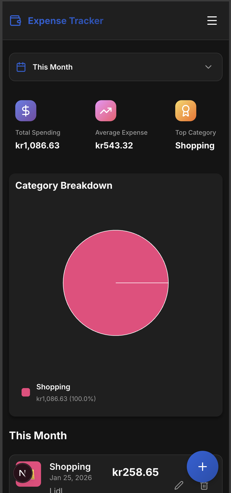

# Bibudget

A modern, responsive expense tracking application built with Next.js 16, Supabase, and React 19. Manage your personal finances with ease, visualize spending habits, and customize your experience.



## Features

- **📊 Interactive Dashboard**: Visual breakdown of expenses by category and comprehensive summary cards (Total Spending, Average, Transaction Count).
- **💸 Expense Management**: 
  - Add, edit, and delete expenses.
  - Categorize spending with default or custom categories.
  - Filter by date ranges (This Month, Last Month, All Time).
- **🎨 Customization**:
  - **Custom Categories**: Create, edit, and delete your own categories with colors and icons.
  - **Currency Support**: Choose your preferred global currency (USD, GBP, EUR, TRY, etc.).
- **🔐 Secure Authentication**: User registration and login powered by Supabase Auth.
- **📂 Data Export**: Export your filtered expenses to CSV.
- **📱 Responsive Design**: Optimized for desktop and mobile devices.

## Tech Stack

- **Framework**: [Next.js 16](https://nextjs.org/) (App Router)
- **Language**: TypeScript
- **Database & Auth**: [Supabase](https://supabase.com/)
- **Styling**: CSS Modules (Scoped, zero-runtime)
- **Icons**: [Lucide React](https://lucide.dev/)
- **Charts**: [Recharts](https://recharts.org/)
- **Testing**: [Playwright](https://playwright.dev/)

## Prerequisites

- Node.js 18.17+ 
- NPM or Yarn
- A Supabase project (for database and auth)

## Installation

1. **Clone the repository**
   ```bash
   git clone https://github.com/yourusername/expence_tracker.git
   cd expence_tracker
   ```

2. **Install dependencies**
   ```bash
   npm install
   ```

3. **Configure Environment Variables**
   Create a `.env.local` file in the root directory and add your Supabase credentials:
   ```env
   NEXT_PUBLIC_SUPABASE_URL=your_supabase_project_url
   NEXT_PUBLIC_SUPABASE_ANON_KEY=your_supabase_anon_key
   ```

4. **Database Setup**
   Ensure your Supabase project has the required tables (`profiles`, `expenses`, `user_settings`). 
   *(Refer to `database/schema.sql` if provided, or use the Supabase dashboard to create them).*

## Running the Application

Start the development server:
```bash
npm run dev
```

Open [http://localhost:3000](http://localhost:3000) in your browser.

## Running Tests

This project uses **Playwright** for End-to-End (E2E) testing.

**Run all tests:**
```bash
npm test
```

**Run specific test file:**
```bash
npx playwright test tests/e2e/dashboard.spec.ts
```

**Run with UI Mode (Interactive):**
```bash
npm run test:ui
```

**View HTML Report:**
```bash
npm run test:report
```

## Project Structure

```
├── app/                  # Next.js App Router pages
│   ├── auth/             # Login/Signup pages
│   ├── settings/         # Settings page
│   ├── layout.tsx        # Root layout with Providers
│   └── page.tsx          # Main Dashboard
├── components/           # Reusable UI components
│   ├── auth/             # Auth forms
│   ├── dashboard/        # Charts and Summary Cards
│   ├── expenses/         # Expense List and Forms
│   ├── settings/         # Category Manager, Currency Selector
│   └── ui/               # Generic UI (Button, Modal, Input)
├── lib/                  # Utilities and Hooks
│   ├── context/          # React Context (Auth, Settings)
│   ├── hooks/            # Custom Hooks (useExpenses, useSettings)
│   ├── supabase/         # Supabase client config
│   └── utils/            # Helper functions
├── tests/                # Playwright E2E tests
│   ├── e2e/              # Test specs
│   ├── fixtures/         # Test fixtures (Auth)
│   └── pages/            # Page Object Models
└── public/               # Static assets
```

## License

This project is licensed under the MIT License.
